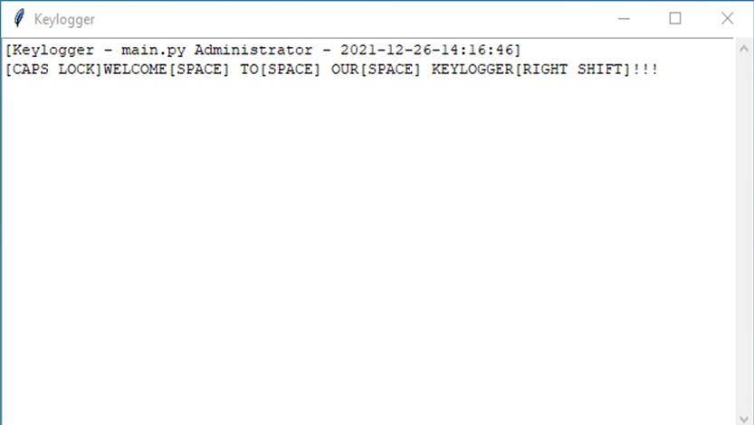

# Keylogger
Keylogger stores the pressed keys. In this program, there are two commands for trying some functions.
In keylogger, active window and date data are saved.

## Checking Keys
When you press CTRL+ALT, a window opens and shows the pressed keys.

## Sending Email
When you press CTRL+SHIFT+ALT+ENTER, pressed keys saved LOGS.txt and send your email as file.
